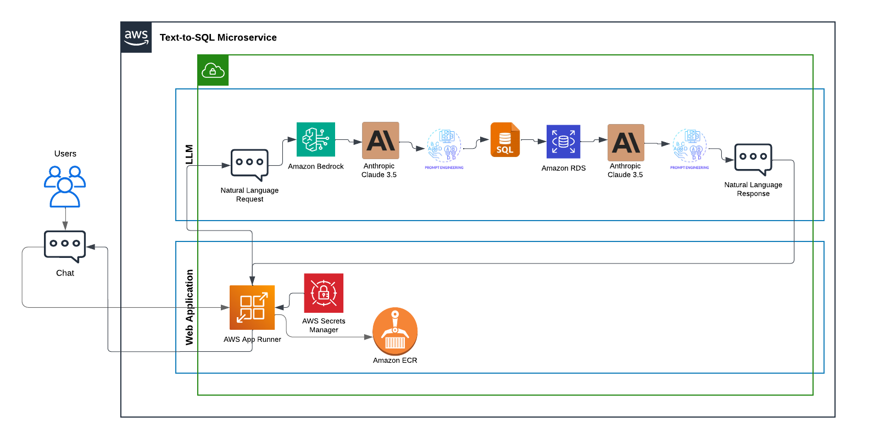

Check CI/CD Status: 

[](https://github.com/Afag-Ramazanova/DE_final_project/actions/workflows/install.yml) [](https://github.com/Afag-Ramazanova/DE_final_project/actions/workflows/lint.yml) [](https://github.com/Afag-Ramazanova/DE_final_project/actions/workflows/format.yml) [](https://github.com/Afag-Ramazanova/DE_final_project/actions/workflows/test.yml) [](https://github.com/Afag-Ramazanova/DE_final_project/actions/workflows/ecr.yml) [](https://github.com/Afag-Ramazanova/DE_final_project/actions/workflows/deploy_rds.yml)
# AskSQL Natural Language to SQL Microservice
[](https://zztaz2qbqh.us-east-2.awsapprunner.com/)

#### Click to access AskSQL ⬆️

#### Contributors:
[Afag Ramazanova](https://github.com/Afag-Ramazanova),
[Loo Si Min (Lucy)](https://github.com/loosimin16),
[Rishika Randev](https://github.com/rrandev03),
[Seijung Kim](https://github.com/seij001),
[Tursunai Turumbekova](https://github.com/tursunait)

## Overview
This project is a **microservice solution** designed to empower businesses to interact with their Invenroty database on AWS RDS using **natural language questions**, removing the need for SQL expertise. It is a robust and scalable application that leverages AWS services and cutting-edge AI to convert human-readable queries into SQL commands, retrieve data from the database, and respond with answers in natural language. It leverages AWS services and AI-powered tools to deliver an efficient, cloud-native experience.

### Key Features:
- **Microservice Architecture**: Built as a standalone, containerized microservice using a Docker image.
- **User-friendly Interface**: A simple web application for inputting natural language questions.
- **AI-Powered SQL Conversion**: Utilizes **Anthropic Claude 3.5** through AWS Bedrock to convert questions into SQL queries.
- **Database Interaction**: Queries data from an **AWS RDS** database.
- **Natural Language Responses**: Returns the results in natural language, displayed on the web page.
- **Cloud-Native Deployment**: Hosted on AWS using **AppRunner**, with container images stored in **ECR**.
- **Performance Validated**: Load-tested to handle 10,000 requests per second.
- **CI/CD Integration**: Automated pipeline for dependency installation, code linting, formatting, testing, and deployment.
- **Infrastructure as Code**: Automatic AppRunner deployments with every ECR push, & RDS instance creation through AWS CloudFormation.

## How It Works
1. The user inputs a natural language question via the web interface.
2. The app sends the question to **Anthropic Claude 3.5** through AWS Bedrock.
3. The AI generates an SQL query tailored to the question.
4. The SQL query is executed on the **AWS RDS** database.
5. The results are converted back to natural language and displayed to the user.

## Use Case
This microservice is designed for **business (inventory) users** who need actionable insights from their databases but lack SQL expertise. For this implementation, the database is an **Amazon inventory database**, containing the following columns:
- `name`
- `main_category`
- `sub_category`
- `ratings`
- `no_of_ratings`
- `discount_price`
- `actual_price`

This application is ideal for: retail inventory analysis, sales trend exploration, product category performance evaluation, etc. 
      
 "Dear User,

   To enhance your experience with our system, we’ve prepared a quick guide to the available categories in our database. These categories will help you craft your queries and explore data effectively."

**Main Categories:**
      
      Accessories, Appliances, Bags & Luggage, Beauty & Health, Car & Motorbike, Grocery & Gourmet Foods, Home & Kitchen, Home, Kitchen, Pets, Industrial Supplies, Kids' Fashion, Men's Clothing, Men's Shoes, Music, Pet Supplies, Sports & Fitness, Stores, Toys & Baby Products, TV, Audio & Cameras, Women's Clothing, and Women's Shoes.

**Sub-Categories:**
      
      Air Conditioners, All Appliances, All Car & Motorbike Products, All Electronics, All Exercise & Fitness, All Grocery & Gourmet Foods, All Home & Kitchen, All Pet Supplies, All Sports, Fitness & Outdoors, Amazon Fashion, Baby Bath, Skin & Grooming, Baby Fashion, Baby Products, Backpacks, Badminton, Bags & Luggage, Ballerinas, Beauty & Grooming, Bedroom Linen, Camera Accessories, Cameras, Camping & Hiking, Car & Bike Care, Car Accessories, Car Electronics, Car Parts, Cardio Equipment, Casual Shoes, Clothing, Coffee, Tea & Beverages, Cricket, Cycling, Diapers, Diet & Nutrition, Dog Supplies, Ethnic Wear, Fashion & Silver Jewellery, Fashion Sales & Deals, Fashion Sandals, Fitness Accessories, Football, Formal Shoes, Furniture, Garden & Outdoors, Gold & Diamond Jewellery, Handbags & Clutches, Headphones, Health & Personal Care, Heating & Cooling Appliances, Home Audio & Theater, Home Décor, Home Entertainment Systems, Home Furnishing, Home Improvement, Home Storage, Household Supplies, Indoor Lighting, Industrial & Scientific Supplies, Innerwear, International Toy Store, Janitorial & Sanitation Supplies, Jeans, Jewellery, Kids' Clothing, Kids' Fashion, Kids' Shoes, Kids' Watches, Kitchen & Dining, Kitchen & Home Appliances, Kitchen Storage & Containers, Lab & Scientific, Lingerie & Nightwear, Luxury Beauty, Make-Up, Men's Fashion, Motorbike Accessories & Parts, Musical Instruments & Professional Audio, Nursing & Feeding, Personal Care Appliances, Refrigerators, Refurbished & Open Box, Rucksacks, Running, School Bags, Security Cameras, Sewing & Craft Supplies, Shirts, Shoes, Snack Foods, Speakers, Sports Shoes, Sportswear, STEM Toys Store, Strength Training, Strollers & Prams, Suitcases & Trolley Bags, Sunglasses, T-Shirts & Polos, Televisions, Test, Measure & Inspect, The Designer Boutique, Toys & Games, Toys Gifting Store, Travel Accessories, Travel Duffles, Value Bazaar, Wallets, Washing Machines, Watches, Western Wear, Women's Fashion, and Yoga.


### Example Queries:
- "Can you find all items with Bluetooth in their name?"
- "Could you show me the names and discount prices of all items in the Car Electronics sub-category"
- "How many products have a rating higher than 4.5?"

## Architecture
The application architecture is built entirely on AWS, ensuring scalability, reliability, and performance:
1. **Web Interface**: Built with Flask for user interaction.
2. **Query Conversion**: Natural language questions are sent to **Anthropic Claude 3.5** via AWS Bedrock to generate SQL queries.
3. **Database Interaction**: SQL queries are executed against an **AWS Relational Dabase Service (RDS)** database.
4. **Response Handling**: Results are translated back into natural language and displayed on the web interface.
5. **Deployment**: The application is containerized and deployed on **AWS AppRunner**, pulling images from **AWS ECR**.



## Technology Stack
- **Backend**: Flask, with Gunicorn as a WSGI HTTP server
- **Programming Language**: Python
- **Containerization**: Docker distroless image
- **AI Model**: Anthropic Claude 3.5 (via AWS Bedrock)
- **Database**: AWS RDS (MySQL)
- **Cloud Services**:
  - AWS [AppRunner](https://us-east-2.console.aws.amazon.com/apprunner/home?region=us-east-2#/services/dashboard?service_arn=arn%3Aaws%3Aapprunner%3Aus-east-2%3A381492212823%3Aservice%2Fflask-auto-tarsl%2F3cac875beec04649847073f24571b2ba&active_tab=logs): for deploying and scaling containerized web applications without managing servers
  - AWS [Elastic Container Registry (ECR)](https://us-east-2.console.aws.amazon.com/ecr/repositories/private/381492212823/flask-app-tarsl?region=us-east-2)
  - AWS Bedrock
  - AWS CloudFormation (IaC)
  - AWS Secrets Manager, for storing sensitive information required by the application to authenticate to Bedrock & RDS
  - AWS CloudWatch, for storing application logs
- **Load Testing**: Validated with a tool to ensure 10,000 requests per second.

- **CI/CD Pipeline**:
  - Install dependencies
  - Lint and format code
  - Test application
  - Build and push container image to ECR
  - Create RDS MySQL instance using AWS CloudFormation

## Deployment Instructions
1. **Prerequisites**:
   - AWS account with access to AppRunner, ECR, RDS, and Bedrock.
   - Docker installed locally.
   - AWS CLI configured.
2. **Clone Repository**:
   ```bash
   git clone <repository_url>
   cd <project_directory>
   ```
3. **Build and Push Docker Image**:
   ```bash
   docker build -t <image_name> .
   docker tag <image_name> <ecr_repository_url>
   docker push <ecr_repository_url>
   ```
4. **Deploy to AppRunner**:
   Use the AWS Management Console or CLI to create an AppRunner service pulling the container image from ECR.

## CI/CD Pipeline
The project includes a CI/CD pipeline for streamlined development and deployment. The pipeline consists of the following stages:
1. **Install Dependencies**: Ensures all required packages are installed.
2. **Lint Code**: Checks for code quality and adherence to standards.
3. **Format Code**: Automatically formats code for consistency.
4. **Test Code**: Runs automated tests to validate functionality.
5. **Deploy**: Builds and pushes the Docker image to ECR. AppRunner service is set up to automatically re-deploy the app when a new container image is pushed to ECR repository.

## Application Logging
Application logs are streamed to [CloudWatch](https://us-east-2.console.aws.amazon.com/cloudwatch/home?region=us-east-2#logsV2:log-groups/log-group/$252Faws$252Fapprunner$252Fflask-auto-tarsl$252F3cac875beec04649847073f24571b2ba$252Fapplication/log-events/instance$252Fd0bc550b632f4bc3b50630d97a78b1dc), and capture basic user interactions, Bedrock calls, as well as errors:


## Quantitative Assessment

The system has been load-tested to handle 10,000 requests per second. Key metrics include:
- **Average Latency**: Measured across various request loads (100, 1,000, 10,000).
- **Error Rates**: Maintained under acceptable thresholds during testing.

- The detailed assessment is accessible here: [PDF](quant_assessment/Locustfinal.pdf), [CSV](quant_assessment/Locust_2024-12-09-13h05_load_test.py_https___zztaz2qbqh.us-east-2.awsapprunner.com_requests.csv)


## Demo Video

A video walkthrough demonstrating the application, including load testing and performance metrics, can be found here.
[Watch the video on YouTube](https://youtu.be/w0pna0C-Wqk)

## Limitations
- The application is currently not able to gracefully handle scenarios where the user asks questions outside of the scope of the inventory / unrelated to the products (for example, just typing in "hi").
- The LLM sometimes has trouble recognizing the product category that is provided in the user prompt unless it is formatted exactly the way it expects (for example, a search for women's clothing yields unsuccessful results, but 'Women's Clothing' is recognized correctly).
- Complex queries have a high response time, forcing the user to wait for at least a few seconds.

## AI Pair Programming Use
- GitHub CoPilot, ChatGPT, and Gemini provided valuable information when figuring out the code syntax and formatting of various components of the project, given that some team members did not have prior experience in web development and containerization. For example, it was used to create starter code for the Dockerfile, the frontend (HTML), the AWS Bedrock requests, and Flask application.

## Future Enhancements
- Support for additional databases.
- Enhanced natural language understanding for complex queries.
- Advanced visualization options for query results.


Thank you!
